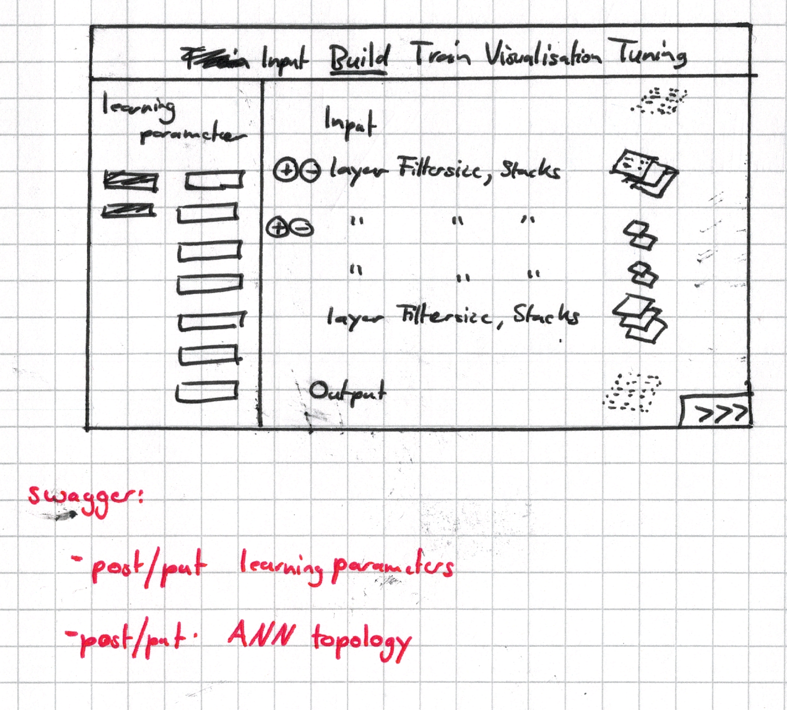
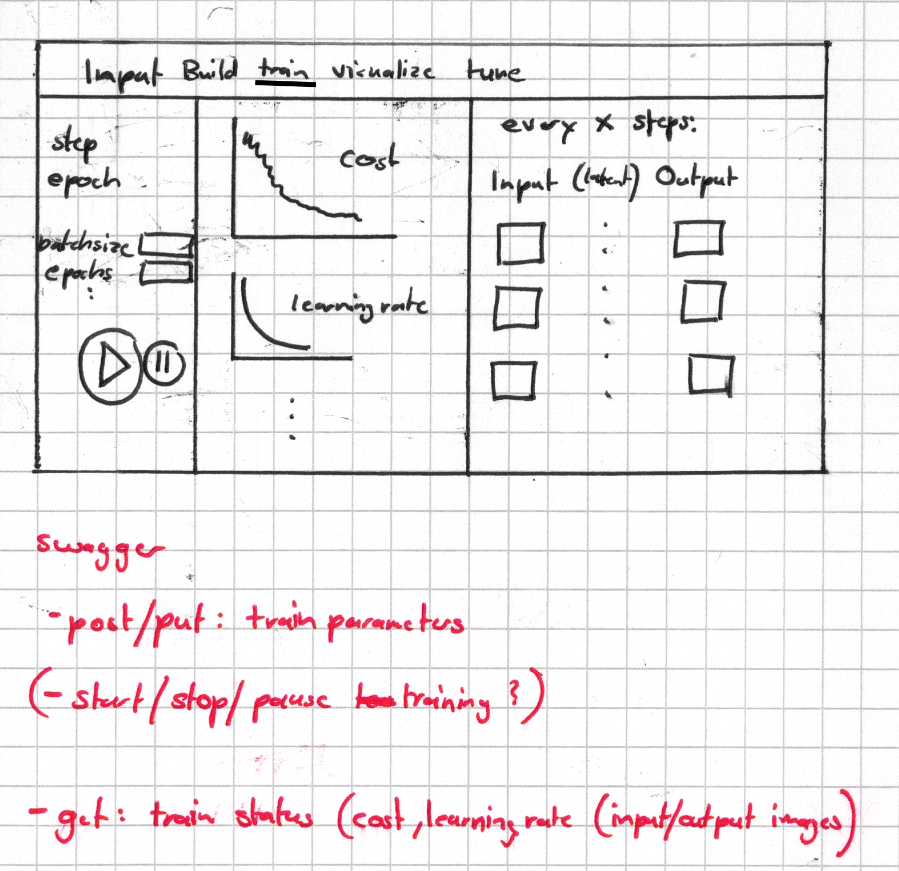
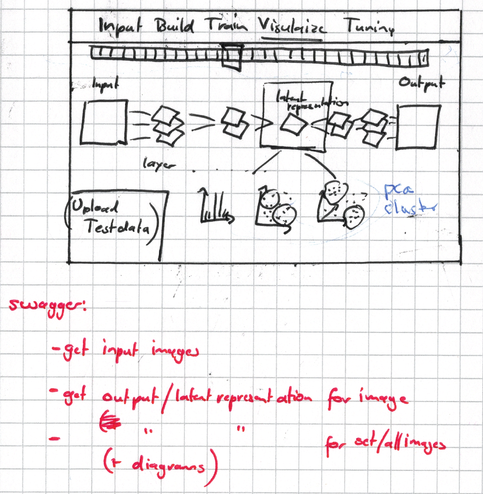
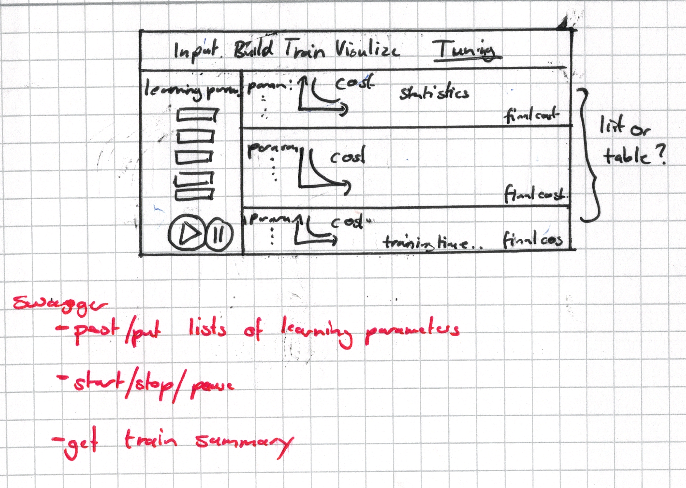

# ConvolutionalAutoEncoder
jsFrontend for building and training a CAE

# Tasks

## Milestones:
    1. Implement Swagger server (till mid January)
        - finish swagger.yaml
        - implement train methods
            - move training to different thread
            - allow server signals for the client
                (- upgrade to OpenAPI 3.0)
        - implement visualisation methods
            - requires improvements in CAE class
        - implement tuning methods
    
    2. Implement Swagger client (till February) 
    
    3. Implement WebUI:
        - overall style (css)
        - Input
        - Build
        - Train
        - Visualize
        - Tuning
    
    4. Improve SklearnCAE class:
        - latent representation
        - clustering
        - PCA
        - finish TODOs
    
# Layout
##Sketches
###Input

###Build

###Train

###Visualize

###Tune
